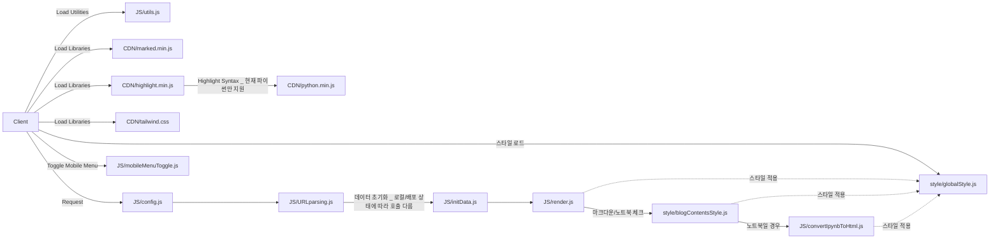
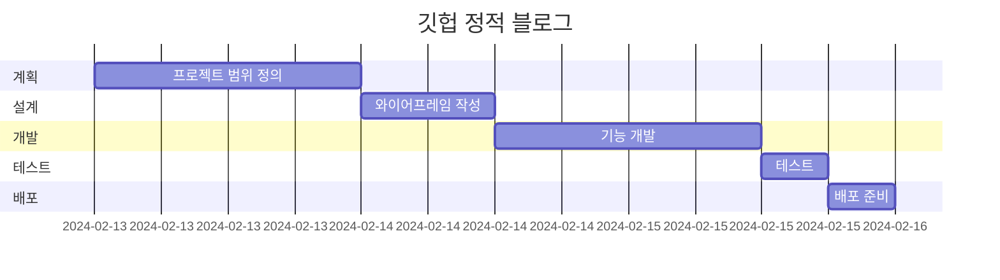

# 이야기 추천 페이지 with ChatGPT
이야기 추천 페이지 with ChatGPT

* 목표
    * 간단한 이야기를 ChatGPT API 통해서 추천서비스 제공

* 사용방법
    1. https://mkdirlife.github.io/NovelRecommand 로 접속해주세요.
    2. input에 질문에 맞는 답을 입력하고, 버튼을 눌러주세요.

* 서비스 URL 정보
    * 실행 URL: https://mkdirlife.github.io/NovelRecommand
    * blog github repo: https://github.com/mkdirlife/NovelRecommand
    

* 맛집추천 페이지 with ChatGPT와 비교

* 구조

* 폴더 트리

    | 폴더명 | 파일명 | 함수 | 변수 | 비고 |
    |--------|--------|------|------|------|
    | style  | globalStyle.js | | | 전역 스타일 설정 |
    | style  | blogContentsStyle.js | | | 블로그 컨텐츠 스타일 설정 |
    | JS     | config.js | | siteConfig | 사이트 설정 정보 |
    | JS     | URLparsing.js | extractFromUrl() | url(url obj), pathParts(쿼리스트링), isLocal | URL 파싱, 스키마 확인 |
    | JS     | render.js | renderBlogPosts(), renderMenu() | | 데이터를 DOM에 렌더링 |
    | JS     | initData.js | initDataBlogList(), initDataBlogMenu() | blogList, blogMenu | 초기 데이터 로딩, 스키마 확인 |

* 코드 컨벤션과 변수 컨벤션
    * 변수명(함수명): 역할
        * blogList(initDataBlogList): (fetch) repo에서 blog폴더에 있는 파일 명을 정규표현식으로 파싱, 데이터가 이미 있다면 다시 통신하지 않음.
        * blogMenu(initDataBlogMenu): (fetch) repo에서 menu폴더에 있는 파일 명을 파싱, 데이터가 이미 있다면 다시 통신하지 않음.
        * posts: (fetch) post의 정보를 가져와 데이터 저장, 재접속시 , 데이터가 이미 있다면 다시 통신하지 않음.
        * url
            * url: 현재 url
            * pathParts: split된 url
            * origin: href + pathname
        * isLocal: 로컬과 배포여부

* WBS

* 화면 정의서
    <table>
        <tr>
            <th>메인화면</th>
            <th>설명</th>
        </tr>
        <tr>
            <td width="70%">
                
            </td>
            <td>
                <ul>
                    <li>필요 정보 입력 후</li>
                    <li>일정 생성 버튼 클릭</li>
                    <li>하단 여행일정에  표로 일정 구현</li>
                    <li>logo 클릭시 리셋</li>
                </ul>
            </td>
        </tr>
    </table>

* 애러와 애러 해결(트러블슈팅 히스토리)
    * 모바일 메뉴 설계
        * 모바일 메뉴와 데스스탑 메뉴를 2개 만드는 일을 이벤트 위임을 통해 해결해야 했으나 중복코드가 발생하더라도 시간을 절약하는 차원에서 모듈화 하지 않음.

* 참고
    * https://github.blog/category/engineering/ 스타일을 참고
    <table>
        <tr>
            <th>레퍼런스 이미지 메인</th>
        </tr>
        <tr>
            <td></td>
        </tr>
    </table>
    <table>
        <tr>
            <th>레퍼런스 이미지 블로그</th>
        </tr>
        <tr>
            <td></td>
        </tr>
    </table>

