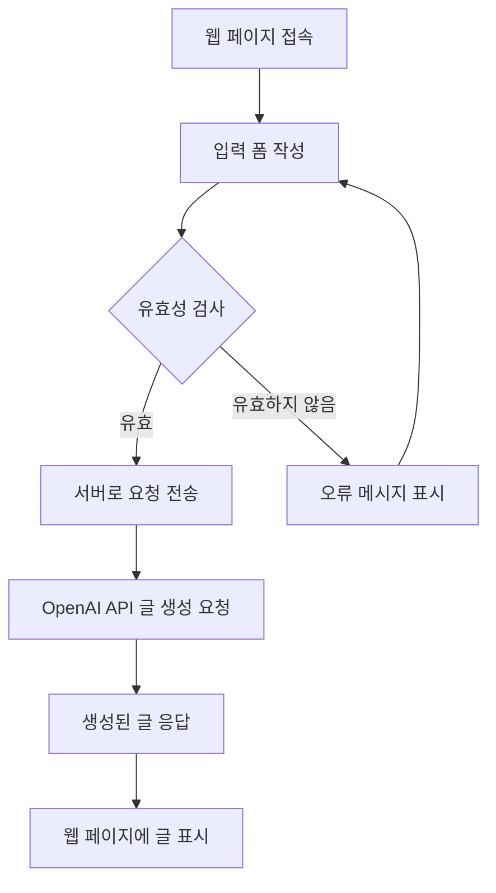
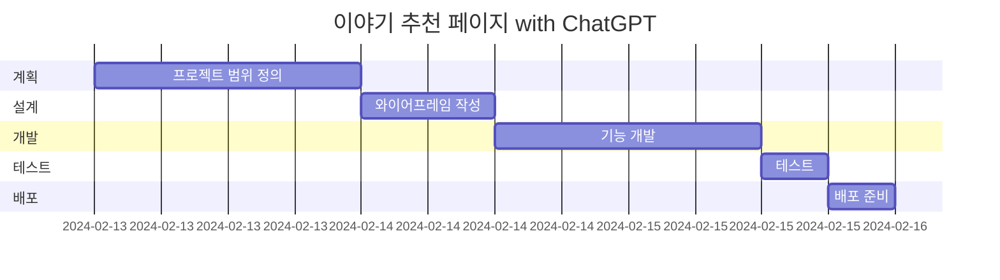
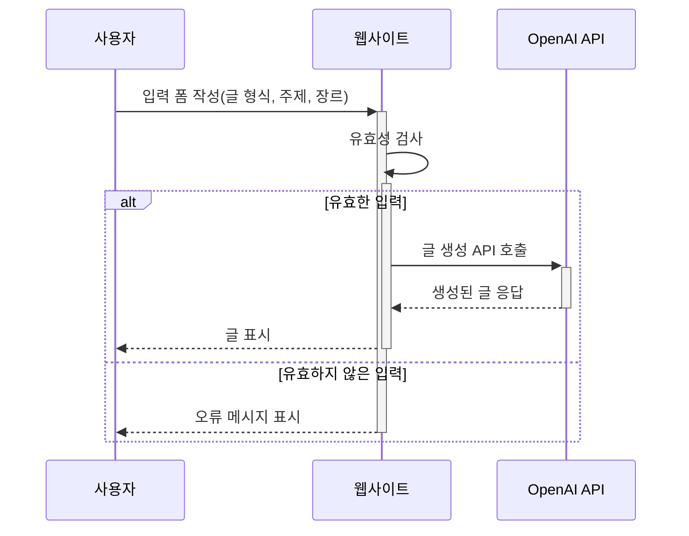

# 이야기 추천 페이지 with ChatGPT
이야기 추천 페이지 with ChatGPT

* 목표
    * ChatGPT API 통해서 간단한 이야기 추천서비스 제공

* 사용방법
    1. https://mkdirlife.github.io/shortStoryRecommand 로 접속해주세요.
    2. input에 질문에 맞는 답을 입력하고, 버튼을 눌러주세요.

* 서비스 URL 정보
    * 실행 URL: https://mkdirlife.github.io/shortStoryRecommand
    * blog github repo: https://github.com/mkdirlife/shortStoryRecommand

* 개발환경
   * 개발툴 : VSCode
   * 개발프로그램 : HTML, CSS, JavaScript
   * 서비스 배포 : GitHub    

* 흐름도

* 폴더 구조

   

* 코드 컨벤션과 변수 컨벤션
    * 변수명(함수명): 역할
        * blogList(initDataBlogList): (fetch) repo에서 blog폴더에 있는 파일 명을 정규표현식으로 파싱, 데이터가 이미 있다면 다시 통신하지 않음.
        * blogMenu(initDataBlogMenu): (fetch) repo에서 menu폴더에 있는 파일 명을 파싱, 데이터가 이미 있다면 다시 통신하지 않음.
        * posts: (fetch) post의 정보를 가져와 데이터 저장, 재접속시 , 데이터가 이미 있다면 다시 통신하지 않음.
        * url
            * url: ChatGPT api 주소
        * isLocal: 로컬과 배포여부

* WBS

* 시퀀스 다이어그램

* 화면 정의서
    <table>
        <tr>
            <th>메인화면</th>
            <th>설명</th>
        </tr>
        <tr>
            <td width="70%">
                
            </td>
            <td>
                <ul>
                    <li>필요 정보 입력 후</li>
                    <li>글 생성 버튼 클릭</li>
                    <li>하단에 짧은 글 추천</li>
                    <li>logo 클릭시 리셋</li>
                </ul>
            </td>
        </tr>
    </table>

* 애러와 애러 해결(트러블슈팅 히스토리)
    * 모바일 메뉴 설계
        * 모바일 메뉴와 데스스탑 메뉴를 2개 만드는 일을 이벤트 위임을 통해 해결해야 했으나 중복코드가 발생하더라도 시간을 절약하는 차원에서 모듈화 하지 않음.

* 참고
    * https://github.blog/category/engineering/ 스타일을 참고
    <table>
        <tr>
            <th>레퍼런스 이미지 메인</th>
        </tr>
        <tr>
            <td></td>
        </tr>
    </table>
    <table>
        <tr>
            <th>레퍼런스 이미지 블로그</th>
        </tr>
        <tr>
            <td></td>
        </tr>
    </table>

